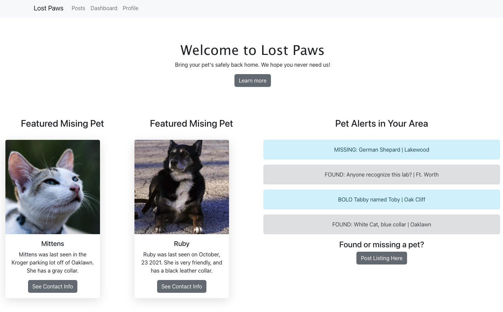

## Lost Paws

## Table of Contents
   
   [Installation](#Installion)
   
   [About this Project](#About-this-Project)
   
   [User Story](#User-Story)
   
   [Screenshots](#ScreenShots)
   
   [Contributors](#Contributors)
   
   [Links](#Links)
   
   ## Installation
An application that will run in the browser and feature dynamically updated. Application features polished UI and is responsive, ensuring adaptation to multiple screen sizes.

To build this webpage we used: Bootstrap - Javascript - React - Graphql - Node.js - Heroku

## About this Project
Lost Paws is a platform for pet owners to post and comment about their lost and found pets. Pet lovers can post about their pets, sightings and information, and comment on other posts to bring pets home. 

## User Story
As an owner of a lost pet, I want to be able to use a platform to create an account, post about my lost pet, get comments and interact with other users to find my pet and bring them home.

## Contributors
Jeffry Langford, Ethan McCann, Sam Clark, Safiya Simmonds, and Paulina Gamboa.

## Screenshots

## Links
Deployed link: https://lost-paws.herokuapp.com

Github link: https://github.com/pgamboa322/project3
   

